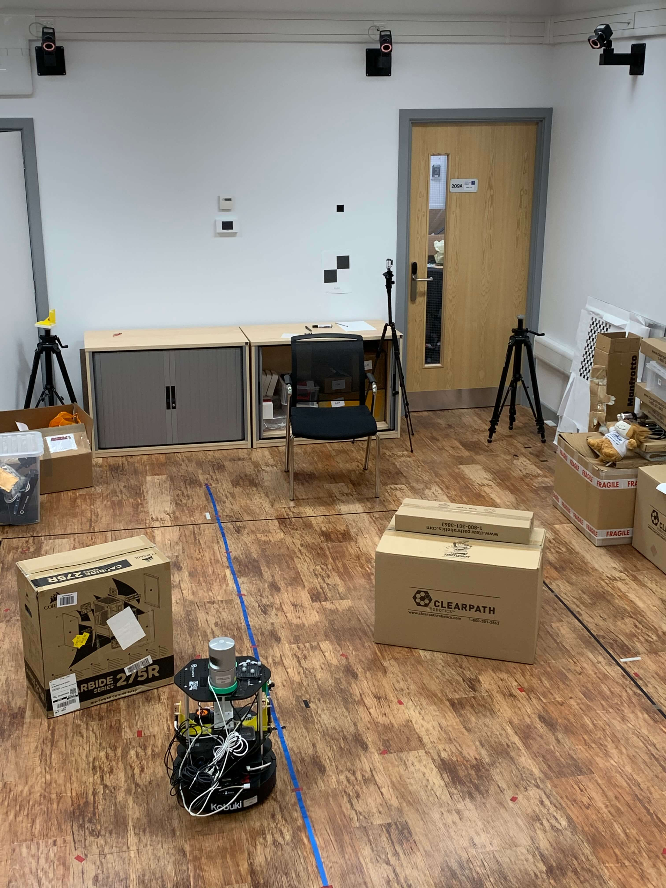

# vReLoc

The vReLoc dataset is an indoor dataset consisting of LiDAR point clouds, RGB-D images and ground truths.

## Robot Setup
The experimental robot is Turtlebot 2, mounted with a Velodyne HDL-32E LiDAR and an Intel RealSense Depth Camera D435. The sensors have been carefully calibrated. The Velodyne is a lightweight pulsed laser for Detection and Ranging, which features 32 lasers across over a 40° vertical field-of-view and a 360° horizontal field-of-view. It runs at a frequency of 10Hz. Each point cloud in the dataset contains ~60,000 points. The camera was employed to capture RGB images, and the size of each image is 640 × 480 × 3. A Vicon Motion Tracker system is leveraged for acquiring accurate ground truth 6-DoF poses. 10 Bonita B10 cameras are used in the system, installed around the area where the dataset is collected. Each Bonita B10 has the resolution of 1 megapixel with 250 fps frame rate, and an operating range of up to 13 m. The system can track the pose of the robot at a precision of ~1cm.

## Data Collection Setup
The size of the Vicon room is about 4 m × 5 m. We lay out several obstacles in the scene. For the relocalization task, the scene is fixed through the whole data collection process. We utilized the Robot Operating System (ROS) for robot control and data collection. Timestamps were recorded on every frame of each sensor by the ROS, and we synchronized world timestamp across different systems from the same Network Time Protocol (NTP) server. The Vicon room is shown as below:  

## Dataset Description
A total of 18 sequences were collected of various lengths. Since the Velodyne LiDAR, RealSense camera and Vicon motion tracker system run in different frequencies, we synchronized these systems so that the image and LiDAR in each timestamp has the same 6-DoF pose. For the static scenario, there are no moving objects in the scene. For other scenarios, there are people randomly walking in the scene. Sequences 01-10 come from the static environment, sequences 11-15 are the one-person moving scenario, and sequences 16-18 are two-persons moving scenario.

## Data Format
The format of file name in the vReLoc follows the format of the indoor [Seven Scenes](https://www.microsoft.com/en-us/research/project/rgb-d-dataset-7-scenes/) dataset. Each frame in the dataset consists of four files:

  -LiDAR Point Cloud: frame-XXXXXX.bin  
  -Color: frame-XXXXXX.color.png  
  -Depth: frame-XXXXXX.depth.png  
  -Ground Truth Pose: frame-XXXXXX.pose.txt  

The data format of the LiDAR point cloud follows the format of the [Oxford Radar RobotCar](https://oxford-robotics-institute.github.io/radar-robotcar-dataset/), so we can directly reuse APIs from the Radar RobotCar. Sample files can be downloaded from the repository.

## Download 
Please download the dataset from the Google Drive (15.0 GB in total).  
[[dataset]](https://drive.google.com/file/d/1X1kGrncnGcldGM5EzujFDDhdlBiasv1q/view?usp=sharing)

## Citation
If you use this dataset in your research, please cite the following paper:

**PointLoc: Deep Pose Regressor for LiDAR Point Cloud Localization**  
Wei Wang, Bing Wang, Peijun Zhao, Changhao Chen, Ronald Clark, Bo Yang, Andrew Markham, Niki Trigoni  
[[paper]](https://arxiv.org/abs/2003.02392)
